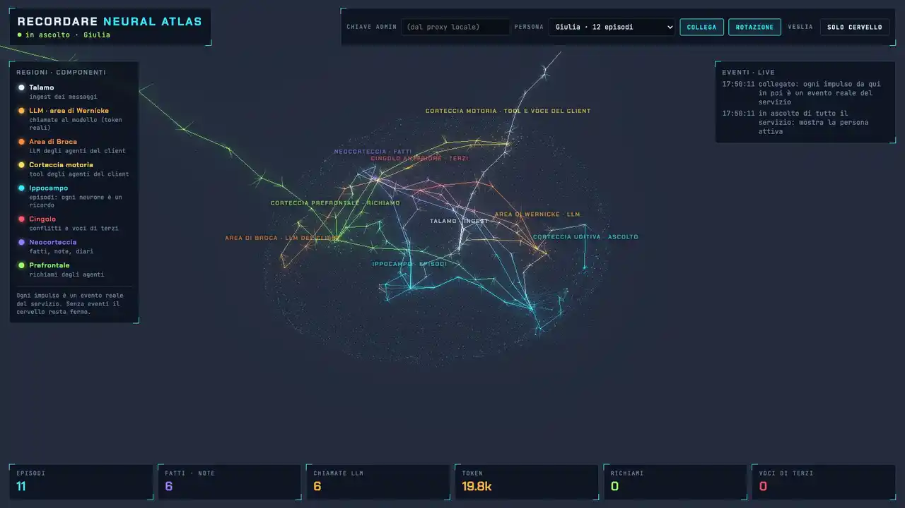

# Recordare

<p align="center"></p>
<p align="center"><sub><a href="https://github.com/arkimedehq/recordare-atlas">Recordare Atlas</a>, la vista live opzionale del cervello: eventi reali di una sessione scriptata (pagina in inglese); tagliate le pause senza attività.</sub></p>

*Recordare*: in latino "ricorda!" (*re-* + *cor*, "riporta al cuore").

Recordare è un **servizio di memoria a lungo termine per agenti IA**, indipendente dalle piattaforme. Conserva una memoria per
persona: ciò che ha vissuto, pianificato, detto e ciò che le è stato detto, con date, fonti e storia. È il fondamento
di un **gemello digitale** dichiarato di quella persona. Qualsiasi piattaforma di agenti può usarlo tramite **MCP**
(qualsiasi client MCP) oppure tramite **MCP + ingest REST** (la piattaforma invia le sue conversazioni e Recordare
estrae la memoria in background). [Arkimede](https://github.com/arkimedehq/arkimede) è il primo client.

> **Stato (2026-10-07).** La fase 1 (memoria episodica) è implementata in `service/` (NestJS, Postgres + pgvector,
> BullMQ). Comprende il log grezzo, gli episodi, i piani, i fatti, le note, i digest notturni, gli strumenti MCP di
> lettura e scrittura, l'API di amministrazione e la telemetria in tempo reale. Arkimede è integrato. Prossimi passi:
> l'API di lettura, la libreria client e i connettori ([piano di lavoro](docs/WORK_PLAN_it.md)). La memoria delle
> entità (D48, più sotto) è realizzata e misurata su un dev set. Recordare non è ancora pubblicato.

*Versione inglese (di riferimento): [README.md](README.md). Ogni documento del progetto ha una copia italiana (`*_it.md`); quella inglese è il riferimento.*

## In parole semplici

Gli assistenti IA di solito dimenticano tutto quando finisce una conversazione. Recordare dà loro una **memoria a lungo
termine**, vicina a quella umana. Mentre parli con il tuo assistente, esso tiene una specie di diario: **che cosa è
successo e quando** ("sabato ero a Bologna con Marco"), **che cosa pianifichi** ("giovedì vado dal dentista" — e se non
dici mai com'è andata, non dà per scontato che ci sei andato), **com'è la tua vita adesso e come è cambiata** (la tua
auto, dove vivi, il tuo lavoro, con la loro storia) e **i tuoi gusti e le tue abitudini**. Ogni notte, come facciamo
noi mentre dormiamo, riordina i suoi ricordi e scrive un riassunto della giornata e del mese, così l'assistente può
rispondere a "che cosa ho fatto la settimana scorsa?" o "quando ho cambiato auto?".

Fa attenzione a **chi ha detto che cosa**: ciò che dici tu conta come tua memoria, ciò che ti dice un altro resta suo,
e ciò che l'assistente ha solo ipotizzato non diventa mai un fatto. Puoi correggere un ricordo, e ciò che chiedi di
dimenticare non ritorna. Ogni persona ha la **propria memoria privata**; un dispositivo usato da tutta la famiglia (l'assistente
vocale di casa) può avere una **memoria condivisa**, dove chi si presenta firma i propri ricordi. Nulla parte senza
**consenso**. Recordare funziona con qualsiasi assistente e qualsiasi modello di IA; Arkimede è il primo a usarlo.

## Che tipo di memoria è

Recordare è modellato sulla memoria episodica umana: codifica mentre vivi, consolida mentre dormi, richiama per tempo
e per indizio. Non è un archivio vettoriale di frammenti di chat.

```
Layer 0  raw log     every ingested message, verbatim: provenance and fallback for everything above
Layer 1  episodes    one row per event / plan / state change: event date + precision, people, place,
                     importance, feelings and opinions, evidence message ids
Layer 2  digests     day and month diaries, written by the nightly consolidation
Layer 3  facts       state slots with a value chain ("lives in" Turin → Bologna, with dates)
         notes       durable knowledge: preferences, habits, values, relationships
```

- **Il tempo funziona in entrambe le direzioni (bi-temporale).** Gli episodi hanno un tempo dell'evento con una
  precisione (giorno, mese o approssimata) più l'espressione originale ("domenica scorsa"), risolta rispetto al
  timestamp del messaggio. I fatti portano il tempo del mondo (`valid_from` / `valid_to`) e il tempo della conoscenza
  (quando Recordare l'ha appreso). I fatti si possono interrogare **as of** una data ("dove abitavo a inizio
  dicembre?"). Una correzione (`corrects`: il valore non è mai stato vero) è diversa da un cambiamento (`supersedes`:
  vero fino a *t*). Nulla viene sovrascritto.
- **I piani hanno un ciclo di vita.** Un piano è `open | confirmed | cancelled | rescheduled | unresolved`. Un piano la
  cui data è passata resta un piano finché qualcosa non lo conferma, quindi il richiamo risponde "non so se ci sei
  andato", mai "ci sei andato".
- **Provenienza su ogni ricordo.** Ogni ricordo registra chi lo ha detto: il proprietario, l'assistente, un'altra
  persona o uno strumento (`author_role`). Registra anche la sua origine (`owner_lived`, `owner_told`,
  `assistant_stated`) e cita gli id dei messaggi di evidenza. L'affermazione di un'altra persona ("Giorgio dice che
  Sofia si trasferisce a Londra") è memorizzata come affermazione di quella persona, mai come fatto del proprietario.
- **Contesto dello spettatore su ogni lettura.** Recordare stabilisce chi vedrà un risultato a partire dai partecipanti
  alla conversazione; né il client né l'LLM possono dichiararlo. Nella fase 1 i ricordi vengono restituiti solo quando
  lo spettatore è il proprietario. Gli elementi mancanti e quelli vietati appaiono uguali. Ogni ricordo memorizza già
  il proprio pubblico e un'etichetta di divulgazione, quindi la divulgazione graduata (fase 3) non richiede migrazioni.
- **Consenso per persona.** La chiave API di un client non può mai attivare la memoria di una persona. Il consenso
  viene dall'amministratore (profilo privato) o dal proprietario, e i client non inviano nulla prima del consenso.
- **Dimenticare in modo definitivo.** Dimenticare un episodio lascia una lapide (tombstone). L'estrazione, la
  ri-estrazione e il consolidamento controllano le lapidi prima di scrivere, così il contenuto dimenticato non ritorna.
  I digest che avevano usato l'episodio vengono riscritti. (Dimenticare un intero periodo è progettato ma non ancora
  realizzato.)
- **Consolidamento notturno.** Un job per persona scrive i diari del giorno e del mese. Non fa alcuna chiamata LLM
  quando non c'è nulla di nuovo.
- **Profili di qualità / costo** (D35): `economy | balanced | full`, per installazione con un override per persona. Il
  costo è una scelta del proprietario e la qualità non viene mai scambiata in silenzio. Ogni profilo è misurato.
- **Qualsiasi provider LLM / di embedding** (D27): qualsiasi server compatibile con OpenAI (DeepSeek, OpenAI,
  OpenRouter, Ollama, vLLM, …) oppure Anthropic nativo, con un modello per compito. DeepSeek e Ollama locale sono solo
  i nostri ambienti di test.
- **Una memoria per persona, tra le piattaforme.** Una persona che usa Arkimede e Claude Code ha una sola memoria.

### Strumenti MCP (come realizzati)

`search_episodes` (modalità `search | list | latest`, intervallo di date, ripiego automatico sul log grezzo, estratti
di chat), `search_memory` (note e fatti, opzionalmente as of una data), `resolve_period` (parser deterministico di
periodi IT/EN: "la settimana scorsa", nomi dei mesi), `log_episode`, `remember`, `correct_episode`, `forget_episode`.
Nessun LLM gira in lettura: l'agente chiamante compila i parametri. Contratti: [API](docs/API_it.md), [modello dei
dati](docs/DATA_MODEL_it.md).

## I punti più importanti

1. **L'LLM propone; il codice decide.** L'estrazione fa una chiamata LLM per ogni finestra di conversazione inattiva.
   La chiamata restituisce episodi, patch di piano tipizzate (`confirm | cancel | reschedule | amend`), verdetti sui
   fatti (`keep | replace | corrects | stale | unknown`) e note. Il codice convalida gli id di evidenza rispetto al log
   grezzo e applica le regole del ciclo di vita. L'LLM non cancella né riscrive mai un ricordo.
2. **Protezioni contro l'auto-avvelenamento, nel codice** (D37, D38):
   - Una patch di piano si applica solo se la sua evidenza parla di quel piano.
   - Un elemento detto dall'assistente mentre rispondeva *dalla memoria* non viene riscritto come nuova evidenza (la
     protezione dall'eco del richiamo).
   - Dopo un richiamo, un fatto cambia solo quando qualcuno afferma il cambiamento.
   - Le affermazioni di altre persone sono tenute separate dai fatti del proprietario.
3. **Richiamo consapevole delle persone** (D39). Una domanda che nomina qualcuno, per nome o tramite una relazione
   memorizzata ("mia sorella"), recupera anche i messaggi di quella persona, senza ulteriori chiamate LLM.
4. **Economico per costruzione** (default economy). Una chiamata di estrazione per finestra, controlli deterministici
   prima di ogni chiamata LLM, ragionamento disattivato, prefissi dei prompt stabili per la cache del provider e zero
   chiamate quando non c'è nulla da fare. Nelle esecuzioni misurate, il 67–71 % dei token di input dell'estrazione è
   stato servito dalla cache dei prefissi di DeepSeek.
5. **Misurato su dati ciechi.** I dataset di valutazione sono scritti e verificati da agenti separati che non vedono
   mai i prompt. Le esecuzioni sono ripetute tre volte e confrontate con test appaiati. Ogni esecuzione include
   controlli senza memoria e a contesto completo e baseline di mercato. I numeri sono citati con il loro dataset e le
   loro avvertenze (sezione successiva).

### Risultati misurati (da [RESULTS.md](spikes/memory-eval/RESULTS.md))

Modello di risposta e di giudizio: `deepseek-flash`. Embedding: `bge-m3`. Gli intervalli tra parentesi quadre sono
intervalli al 95 %.

| Dataset | Risultato |
|---|---|
| Spike round 2, rumore (187 sessioni) | Prototipo del nostro design (D) 96 %; Memobase 88 %; Graphiti 81 %; baseline sul log grezzo 67 % |
| Set held-out (scritto alla cieca rispetto ai prompt di D), rumore | D 86 %; Memobase 61 %; baseline 50 % |
| `dataset_blind4` (84 d., nessuno vi ha fatto tuning), base | Servizio v4 80,8 %; Mem0 78,0 %; D 88,3 %; contesto completo (tetto) 89,9 %. È stata la correzione onesta del 95 % misurato su un set già visto |
| `dataset_blind5` (87 d., nuovo), base, 3 esecuzioni | Servizio (lavoro sul richiamo H11) 89,2 % [85,8, 92,6]; D 91,7 %; contesto completo 91,4 %. Il divario rientra nel rumore |
| `dataset_blind7` (46 d., nuovo, scritto da un agente separato), base, 3 esecuzioni | Servizio rilasciato **91,3 %** (88,0 / 92,4 / 93,5); `dataset_blind8` (memoria di entità, 31 d.) 82,1 % |
| `dataset_blind3`, profili di qualità | Economy 93,5 %, balanced 94,9 %, full 92,1 %, tutti nel rumore. Misurato dopo che il set era stato letto, quindi non cieco |
| Dev set dell'eco del richiamo (non cieco) | 79 % senza la protezione → 100 % con la protezione v3 (3 esecuzioni ciascuno) |

Ciò che questi numeri **non** mostrano: i set ciechi sono piccoli (36–87 domande), quindi divari sotto i 5 punti circa
sono rumore. Diversi set ciechi sono stati letti in seguito per correggere errori, e i documenti indicano quali.
I motori locali da 8–20B ottengono 60–83 %, sotto la soglia del 95 % del progetto per un modello di motore supportato.

## Che cosa è nuovo e che cosa no

La regola del progetto è **non rivendicare mai novità senza ricontrollare la letteratura** ([note di
ricerca](docs/RESEARCH_NOTES_it.md), [schede di letteratura](docs/literature/README_it.md)). La fase 1 è per circa
l'85–90 % **integrazione di idee note**, prese in prestito con citazione:

| Idea | Fonte |
|---|---|
| Fatti bi-temporali che scadono invece di essere cancellati | Zep / Graphiti |
| Fatti di profilo a slot, fusione a lotti, tempo di menzione vs tempo dell'evento | Memobase |
| Note con chiavi di recupero | A-MEM |
| Ciclo di vita tipizzato delle intenzioni nel codice | PIS |
| Estrazione vincolata all'evidenza | MemIR |
| Tempo dell'evento vs tempo del dialogo | TSM, LongMemEval |
| Elaborazione a lotti per finestra inattiva | LightMem |

Scartato: trattare ogni fatto come uno stato, pipeline a grafo, aggiornamenti distruttivi, scartare il log grezzo
([idee sul motore](docs/ENGINE_IDEAS_it.md)).

Ciò che è nuovo è più circoscritto:

- **La combinazione, in un unico servizio, dietro qualsiasi piattaforma di agenti.** Abbiamo esaminato Hermes,
  OpenClaw, Letta, Mem0, Honcho, Claude Code e ChatGPT ([memoria delle piattaforme di
  agenti](docs/literature/agent-platform-memory_it.md)). Nessuno di essi combina tempo dell'evento, ciclo di vita dei
  piani e provenienza proprietario-vs-altri a questo livello. OpenClaw è l'unico con provenienza strutturale, e le sue
  regole coincidono con ciò che hanno trovato i nostri esperimenti di avvelenamento ed eco. Quelle piattaforme ci
  precedono nell'iniezione del contesto e nella cura guidata dall'uso.
- **Terreno di ricerca aperto** (il registro delle ipotesi, verdetto "parzialmente nuovo, ristretto"):
  - **H1 — piani non risolti dell'utente.** Un piano dell'utente la cui data è passata senza conferma viene memorizzato
    come *sconosciuto*. È testato insieme all'accumulo di eventi, alla sostituzione di stato e a correzione vs
    cambiamento. Un ciclo di vita dei piani da solo *non* è nuovo (PM-Bench, PIS).
  - **H2 — divulgazione per un gemello personale.** Livelli sociali graduati, confidenze di terzi, etichette che si
    propagano ai digest e alle note, e una valutazione delle difese solo-prompt rispetto al filtraggio pre-recupero con
    interlocutori avversari. Il meccanismo di filtraggio in sé è pubblicato ("Authorization Before Context"); la
    combinazione specifica per il gemello e la sua valutazione sono aperte.
  - **H3 — monitoraggio della fonte per i gemelli.** I ricordi vissuti dal proprietario, ciò che al proprietario è
    stato detto e ciò che il gemello stesso ha vissuto non si mescolano mai.
  - Voci minori: set di valutazione ciechi scritti da un agente separato, e artefatti di giudici troppo severi (H6, una
    nota di metodo). Pensiero a riposo che mantiene vivi i cicli aperti (H12, da progettare). Modalità legacy come
    meccanismi applicabili (H4, solo ingegneria). La memoria attenta ai costi (H5) è già un tema affollato: riportiamo
    i costi e non rivendichiamo nulla.

## Memoria delle entità (D48)

Un proprietario può anche essere un'**entità**: un dispositivo condiviso, un robot domestico, un luogo. Chiunque usi
l'entità legge e scrive la sua memoria. L'identificazione ("sono Andrea"; in seguito un'impronta vocale) dice solo
**di chi** è un ricordo. Dentro la memoria dell'entità, i fatti portano la persona a cui si riferiscono, e un fatto di
un parlante non identificato non viene memorizzato come fatto di nessuno. L'identificazione non concede mai
l'accesso: la memoria *propria* di una persona si raggiunge solo tramite un'identità client sicura vincolata
dall'amministratore. Una protezione nel codice registra un fatto su una persona, o un episodio che la nomina, solo se
la conversazione nomina quella persona (nessuna identità riportata da altre chat). La persona sceglie il tipo sulla
propria piattaforma (Arkimede: impostazioni della memoria) finché la memoria è vuota. **Sperimentale**: 95,5 % sul suo dev
set, ma **82,1 %** su un nuovo set cieco (3 esecuzioni; chi non si presenta viene ancora attribuito a una persona con
nome — [RESULTS.md](spikes/memory-eval/RESULTS.md)).

## Oltre la fase 1

La [visione](docs/DIGITAL_TWIN_VISION_it.md) aggiunge le fasi successive:

- un automodello (stile, valori, schemi decisionali);
- contatti e livelli di divulgazione;
- l'interfaccia del gemello: modalità compagno con il proprietario, procuratore dichiarato verso gli altri (AI Act UE art. 50);
- iniziativa: informare e proporre (L1), poi agire entro una matrice di permessi (L2);
- la voce del proprietario;
- la modalità legacy;
- una modalità di ricerca sui gemelli autonomi.

Vengono modellate solo le persone che acconsentono.

Attorno alla memoria:
- **Recordare Atlas** ([`arkimedehq/recordare-atlas`](https://github.com/arkimedehq/recordare-atlas), opzionale, repo
  proprio): una vista "cervello" in tempo reale di Recordare e degli agenti dei suoi client. Mostra solo metadati, e
  ogni animazione è un evento reale ([contratto](docs/ATLAS_EVENTS_it.md)). Recordare funziona senza.
- **talkiosk** (repo proprio): un dispositivo vocale domestico che parla con Arkimede. L'ascolto continuo è opt-in e
  inserisce le parole di ogni persona riconosciuta nella sua memoria.
- **Connettori** per altre piattaforme di agenti, che condividono una libreria client e una suite di conformità
  (pianificati).

## Installazione

Servono Docker con Compose v2 e una chiave API di un qualsiasi provider LLM compatibile OpenAI (il migliore misurato:
DeepSeek `deepseek-flash`; funziona anche un server locale come Ollama).

```bash
git clone https://github.com/arkimedehq/recordare.git
cd recordare
deploy/install.sh
```

L'**installer guidato** chiede il profilo (**standalone**: Postgres + pgvector, Redis ed embedder bge-m3 propri; oppure
**co-ospitato** accanto ad Arkimede, riusandone Postgres, Redis ed embedder), URL, modello e chiave dell'LLM (nascosta),
la porta e se altri dispositivi della LAN possono raggiungerlo; genera i segreti in `deploy/.env` (permessi 600),
costruisce e avvia lo stack e, nel profilo co-ospitato, può collegare Arkimede. Idempotente: si può rilanciare.
Non interattivo: `deploy/install.sh --profile standalone --yes` con le risposte nell'ambiente (`LLM_API_KEY_FILE`
tiene la chiave fuori dalla riga di comando).

> **Risorse**: standalone ≈ 6 GB di RAM (il solo embedder ≈ 4,5 GB); co-ospitato aggiunge ad Arkimede solo il servizio
> (≈ 100 MB). Disco ≈ 5 GB per immagini e modello. Solo CPU.

Dopo l'installazione, aprire la **console admin** su `http://<host>:<porta>/admin` con `ADMIN_API_KEY` di
`deploy/.env`: creare le persone, attivarne il consenso e dare una chiave a ogni piattaforma client
([INTEGRATION_it.md](docs/INTEGRATION_it.md); Claude Code: §4b). Poi:

```bash
deploy/update.sh    # backup, pull, ricostruzione, riavvio (le migrazioni girano all'avvio)
deploy/backup.sh    # dump del database in deploy/backups/ (da mettere in cron)
```

Impostazioni principali (tutte in `deploy/.env`; ogni manopola con il suo predefinito in [KNOBS_it.md](docs/KNOBS_it.md)):

| Variabile | Cosa imposta |
|---|---|
| `LLM_BASE_URL`, `LLM_MODEL`, `LLM_API_KEY`, `LLM_PROFILE` | Il provider LLM (qualsiasi compatibile OpenAI; `LLM_PROFILE` = particolarità del provider) |
| `QUALITY_PROFILE` | `economy` / `balanced` (predefinito) / `full`: costo contro qualità, per installazione, modificabile per persona |
| `RECORDARE_PORT`, `RECORDARE_BIND` | Porta sull'host (8090) e indirizzo (`127.0.0.1`, o `0.0.0.0` per la LAN) |
| `IDLE_DELAY_SECONDS`, `CONSOLIDATION_HOUR` | Quando una conversazione viene elaborata (dopo 15 min di inattività) e l'ora del riassunto notturno |
| `EMBEDDER_MAX_BATCH_TOKENS` | Batch dell'embedder standalone (2048 ≈ 4,5 GB di RAM) |
| `RECORDARE_PROJECT` | Nome del progetto Compose, per una seconda installazione sullo stesso host |

Altro in [DEPLOYMENT_it.md](docs/DEPLOYMENT_it.md) (profili, dettagli del co-hosting, HTTPS davanti).

## Limiti di questa versione (profilo privato, D33)

Recordare v1 è il **profilo privato (uso personale / ricerca)**: un'installazione gestita da qualcuno di cui gli utenti si
fidano (una famiglia, un laboratorio, un piccolo gruppo), non un servizio pubblico per sconosciuti.
- L'amministratore crea le persone e le chiavi dei client; non ci sono ancora login del titolare, OAuth per MCP,
  collegamento self-service né registro delle letture.
- L'amministratore e le piattaforme client sono fidati: una chiave client agisce per qualunque suo utente, e chi
  gestisce il server può leggere il database.
- HTTP semplice solo su una rete fidata; tutto ciò che è raggiungibile dall'esterno richiede HTTPS e un firewall
  davanti ([DEPLOYMENT_it.md](docs/DEPLOYMENT_it.md)).
- La memoria di ogni persona è isolata da quella degli altri (testato), ma una memoria scritta da un LLM può
  sbagliare: le persone la vedono e la correggono nel loro diario.

Il rafforzamento per un'installazione pubblica è specificato in [API_it.md](docs/API_it.md) §0 ed è rimandato (il
profilo pubblico).

## Avvio rapido (sviluppo)

```bash
docker compose up -d db redis          # Postgres + pgvector on :5433, Redis on :6380
cd service && cp .env.example .env     # set ADMIN_API_KEY, LLM_* and EMBEDDING_*
npm install
npm run build && npm run migration:run # needs DATABASE_URL and EMBEDDING_DIM in the environment
npm run start:dev
```

Prima di ogni commit, esegui `npm run typecheck`, `npm run lint` e `npm test` (la CI esegue gli stessi tre). Il
[README del servizio](service/README_it.md) descrive la struttura e come scegliere un provider o un modello LLM per
compito. Altre due guide: [integrare una piattaforma client](docs/INTEGRATION_it.md) e [deployment](docs/DEPLOYMENT_it.md)
(standalone, o co-ospitato con Arkimede su un piccolo server).

## Struttura del repository

| Percorso | Che cosa |
|---|---|
| `service/` | Il servizio Recordare (NestJS, TypeScript) |
| `connectors/` | Connettori al livello completo: [Claude Code](connectors/claude-code/README_it.md), [Codex](connectors/codex/README_it.md), [OpenClaw](connectors/openclaw/README_it.md), [Hermes Agent](connectors/hermes/README_it.md), [proxy di memoria compatibile OpenAI](connectors/openai-proxy/README_it.md) (AnythingLLM, Open WebUI, LibreChat) |
| `packages/client/` | `@arkimedehq/recordare-client`, la libreria client TypeScript usata dai connettori e da Arkimede |
| `deploy/` | Script di installazione, aggiornamento e backup, file Compose (standalone / co-ospitato) |
| `spikes/memory-eval/` | Harness di valutazione e dataset: confronto tra motori, set ciechi, risultati ([RESULTS.md](spikes/memory-eval/RESULTS.md)) |
| `docs/` | Visione, decisioni di design D1–D48 ([design della memoria episodica](docs/EPISODIC_MEMORY_TODO_it.md)), [piano di lavoro](docs/WORK_PLAN_it.md), contratti, note di ricerca, schede di letteratura |
| `docker-compose.yml` | Stack di sviluppo locale (Postgres + pgvector, Redis, servizio) |
| `CLAUDE.md` | Contesto e convenzioni per le sessioni di sviluppo |

## Repository correlati

- [Arkimede](https://github.com/arkimedehq/arkimede): piattaforma di agenti, il primo client.
- [Recordare Atlas](https://github.com/arkimedehq/recordare-atlas): vista cervello in tempo reale opzionale.
- talkiosk: dispositivo vocale domestico che parla con Arkimede (repo proprio).

## Licenza

[AGPL-3.0-or-later](LICENSE) © 2026 Andrea Genovese. Avvisi di terze parti: [THIRD_PARTY_NOTICES.md](THIRD_PARTY_NOTICES.md);
politica di riuso: [docs/LICENSING.md](docs/LICENSING_it.md).
